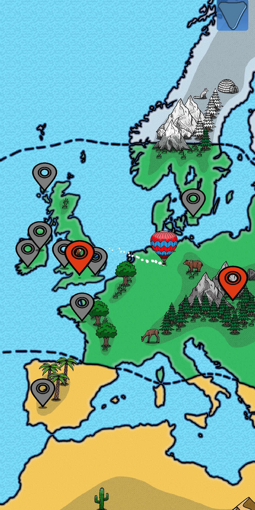
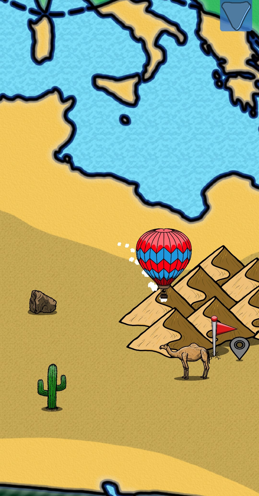
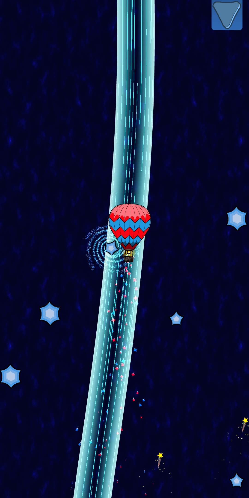

# Cosmic Balloons

## Project Description
Cosmic Balloons is a game intended to ease people into a relaxed, receptive state. Explore 19 locations across 6 'Biomes' and 13 'Monuments' (Prototype contains only 1 of each). Fly your balloon around the world and float into the cosmos. Control the wind in the 'Forest Biome' and dance among the stars on your way to the Cosmos.  (Game intended for Android)

The project was developed for an external client. The goal of the project was to create an app, that allowed children to enter a relaxed, receptive state to help them digest an audio meditation journey. Particular focus was put on making the game accessible to children on the autistic spectrum. This meant that artistic and design decisions were made to ensure the ease of use for all users.

## My Work
My role on “Cosmic Balloons” was gameplay programmer and tech lead. This meant that I was in charge of both gameplay on the games map, the monument journeys into space and any additional project tech like source control.

### Gameplay
#### Map to the Cosmos
I implemented the player movement on the world map and the logic to implement all Kingdom and Monument sites. This required implementation of phone touch controls for both movement and camera controls, world space UI to allow the player to land at sites to explore and map polish like extra animations and interactive art.

#### Monument Journeys
The Monument Journeys all start at a specific spiritual monument. The player is then allowed to cut loose their hot air balloon and journey upwards into space. This required implementation of interactables in the sky that the player could fly through, balloon movement and “Cut the Rope” style ropes to release the balloon.

### UI
The World space UI used to represent the monuments and kingdoms cause much grief throughout the project.

The Unity version the project started on contained a bug that hindered world space UI from being rendered in builds. This required us to upgrade the project to a beta version of Unity which caused issues of its own. However, this taught me valuable lessons in debugging issues and testing a project frequently in both editor and build.

### Optimisation
As “Cosmic Balloons”was intended to be a phone app, a lot of importance was placed on optimising the project for use on as many versions of Android as possible. Primarily, optimisation focused on Memory management and optimization. This meant compressing and optimising audio files, art assets and improving loading in of new scenes.

## Usage Help
An APK and Windows build of the project is available on the projects Itch.io page (https://thefitzyg.itch.io/cosmic-balloons).
